## 点餐系统实现（含数据库）

作者：LoanCold

这是作者的数据实验，但是感觉对于大家配置环境什么的还是很友好的，所以想分享出来。因为时间比较紧张，在命名和注释中可能没有太谨慎，会有很多不合规范，也触犯了工程学的禁区的地方，大家指出来issue一下最好，也记得规避噢。

不管怎样，能跑就行啦，哈哈。

### 实验环境

*请填写用到的操作系统和主要软件版本。*

- Python 3.9.4 (tags/v3.9.4:1f2e308, Apr  4 2021, 13:27:16) [MSC v.1928 64 bit (AMD64)] on win32


- GUI: Tkinter


- Python mysql library: pymysql


- Windows10 version:19042.867


- Mysql Workbench 8.0 CE


- mysql  Ver 8.0.23 for Win64 on x86_64 (MySQL Community Server - GPL)


- PyCharm 2020.3.5 Community Edition


 

#### 使用

我们将在python环境下运行该工程。其中作者悉心考虑到环境配置问题，前端后端都采用python，无需跨语言跨环境，GUI使用了标准库Tkinter（不用下载依赖）。

但是考虑到我们要使用数据库，因此还是选择了广泛使用的Mysql数据库，该数据库必须要提前下载对应的环境（mysql还会要求Visual Studio环境）。

下载连接：https://dev.mysql.com/downloads/

选择下图所示选项（针对windows）。我们一般会勾选workbench，因为我们可以很方便的使用它来操纵数据库。如果遇到相关的问题可以百度解决。

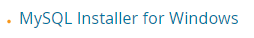

好了，现在完成了mysql的安装，但是这并不代表一切都完成了，最后一步是为python引入**pymysql**库，请自行下载。

>pip install pymysql

这条命令或许有用。如果在pycharm使用，那不要忘记要在对应环境里运行这条命令，而不是主机。

##### 预先配置数据库

因为我们使用了对应的数据库，如果没有数据库的话我们是没有办法使用的噢。作者将自己使用的库已经导出为restaurant.sql 文件，数据库导入的方法可以见：https://www.cnblogs.com/lonmyblog/p/9235136.html

##### 在pymysql中连接数据库

数据库导入之后，python代码运行的时候会需要连接数据库，这个时候我们要在文件database.py中连接数据库的语句改为：

```python
db = pymysql.connect(host="localhost", user="root", password="你的密码", db="restaurant", charset="utf8")
```

##### 开始遨游吧

尽管尽量少的使用额外环境，尽量详细的列出环境配置步骤，但是还是有很多事要做，也可能有遗漏的部分，大家不妨自己查查百度的资料。

### 系统功能

点餐系统以后端mysql为数据基础，在python的GUI库Tkinter的支持之下，为用户完成点餐程序，其主要功能包括：点餐数据统计、点餐并结算（包括入座、会员、折扣、点菜、结算）。

#### 入座

点菜系统将餐桌考虑在内，以满足不同用户同时点餐，并且要求不能在占用的餐桌就坐。入座的时候还可以使用会员号标识其身份，获得点餐的积分并支持使用积分抵扣优惠。

这里我们还加入了打样的操作，清空所有餐桌，强制结算所有的账单，不允许再进行点餐，关店休息。

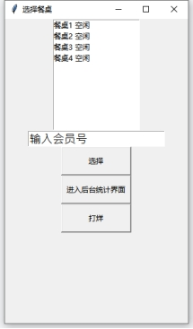 

#### 点菜

进入点菜界面后，会根据用户输入的会员号查询对应的会员，若存在则同时展示其积分信息，若不存在则新建会员并积分置0.同时，考虑到用户隐私，我们也支持用户不使用会员来进行点菜。

同时，根据选择的餐桌，会有对应不同的服务员为用户服务，这是根据当前餐厅常见的服务员-餐桌职务分配制度（比如海底捞）来制定的。服务员与餐桌对应，方便后续管理。

点菜系统将菜品按照菜系进行分类，菜品和菜系都是存储在数据库的内容，会根据数据库的内容进行动态展示，也会随着用户对菜系的选择显示对应的菜品。用户可以点击对应的菜品添加到订单中，在确定之后，可以进行结账。

 

 

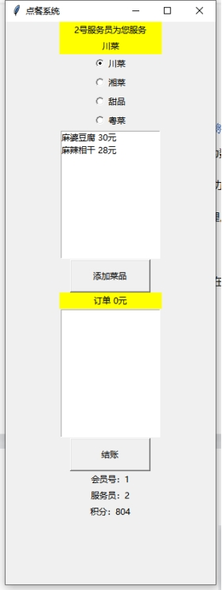 

点菜界面

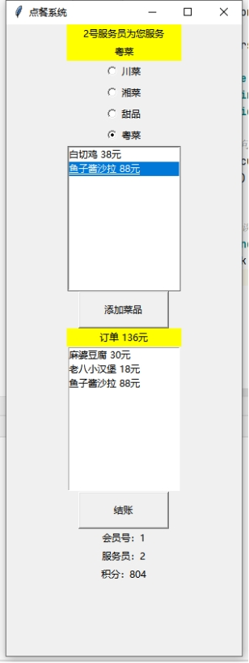 

点菜后

####  结账

用户在结账之后，如果有会员将可以选择使用积分抵扣。列表中会列出会员积分可以使用的规则，也就是如果会员的积分不够，优惠列表将为空，会员也没有办法使用优惠。

会员使用优惠之后将会扣除对应的积分，结账也减少对应的金额。

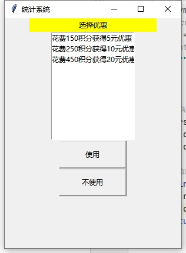 

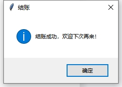 

 

#### 店铺统计信息

点餐系统能够统计销售情况，包括：按菜品销量排序（总）、按时间段销量排序

、查询某时间段内销售总额。系统也会对输入的时间进行合法检测。

 

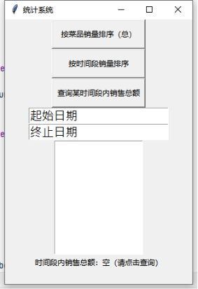 

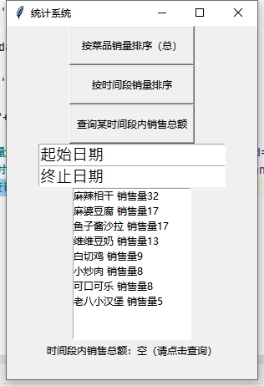 

按菜品销量排序（总）

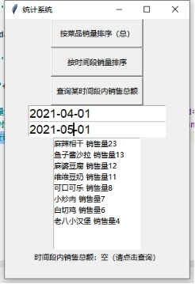 

按时间段销量排序

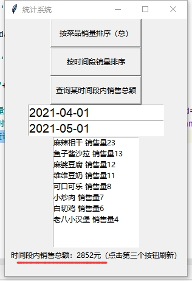 

查询某时间段内销售总额

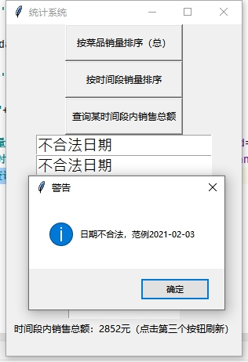 

非法日期检测